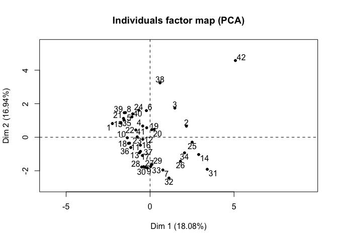

Clustering and PCA
================

The code described in this notebook decribe how to perform hierarchal clustering to create dendrograms and how to perform simple principal component analysis (PCA) in R using multiple methods. Clustering is applied to differential gene expression (DGE) files. PCA is performed on storm data with multiple parameters.

Hierarchical clustering and Dendrograms
=======================================

Potential relationships between treatment and control groups of DGE data of up- or down- regulated genes is examined through hierarchical clustering. The data here was read in from .tab files as a table.

``` r
data <- read.table("DGEdata.tab", header = TRUE, sep="\t") 
```

**Select data to cluster-**
Filter data to isolate relationships you want to examine. The data here is looking at all timepoints from a treatment group, but a specific timepoint was also examined.

``` r
library(dplyr)
```

    ## 
    ## Attaching package: 'dplyr'

    ## The following objects are masked from 'package:stats':
    ## 
    ##     filter, lag

    ## The following objects are masked from 'package:base':
    ## 
    ##     intersect, setdiff, setequal, union

``` r
allAb <- data[,2:33]
#allAb <- select(data, contains("Ab"))
#Ab48 <- select(allAb, starts_with("T48"))
```

**Normalization-**
Data is converted to a matrix, zero values are adjusted by added 0.01 (any small number is good). The values are normalized by dividing values by the sum of gene counts for the group (sum of columns). The normalized or normalized log of these values is used and the matrix is transposed (t()) to get in proper format.

``` r
allAb_matx = as.matrix(allAb + 0.01)
allAb_sumx = apply(allAb_matx, 2, sum)
allAb_normx = t(allAb_matx / allAb_sumx)
allAb_logx = t(log(allAb_matx / allAb_sumx))
```

**Create distance matrix-**
Different methods are used to create distance matrices that may elucidate clustering data. The two used here are euclidean and bray-curtiss. Euclidean is a basic method that used squared distances. Bray-Curtis creates a matrix based upon similarity. It is often used in ecology and is useful for looking at communities. The Euclidean matrix is availalbe throught the dist() fuction. The Bray-Curtis method is available through the vegan package (vegdist()).

``` r
library(vegan)
```

    ## Loading required package: permute

    ## Loading required package: lattice

    ## This is vegan 2.5-3

``` r
allAb_eucl = dist(allAb_logx, "euclidean")
allAb_brayl= vegdist(allAb_logx, "bray")
```

    ## Warning in vegdist(allAb_logx, "bray"): results may be meaningless because
    ## data have negative entries in method "bray"

``` r
allAb_eucn = dist(allAb_normx, "euclidean")
allAb_brayn= vegdist(allAb_normx, "bray")
```

**Perform hierarchical cluster analysis-**
hclust() fucntion inputs a distance matrix and clusters data iteratively. Like distance matrices, different methods are available. Complete finds similar clusters and Ward's finds clusters using minimum variance to find compact clusters. Single linkage uses a "friend of friends" method. Wards is a good choice for DGE data; wards.D2 uses implements criterion from Ward's(1963) which distances are squared before cluster updating. THe ward.D version does not.

``` r
allAb_euc_wards = hclust(allAb_eucl, method = "ward.D2")
allAb_bray_wards = hclust(allAb_brayn, method = "ward.D2")
```

**Create dendrograms-** The hclust() function outputs a list of several components. To visualize results it is useful to employ a dendrogram. hclust() data is converted with as.dendrogram(). The package dendextend is used to tweak dendrogram plots.

``` r
allAb_euc_wards_dendogram = as.dendrogram(allAb_euc_wards)
allAb_bray_wards_dendogram = as.dendrogram(allAb_bray_wards)

#plot dendrogram
library(dendextend)
```

    ## 
    ## ---------------------
    ## Welcome to dendextend version 1.9.0
    ## Type citation('dendextend') for how to cite the package.
    ## 
    ## Type browseVignettes(package = 'dendextend') for the package vignette.
    ## The github page is: https://github.com/talgalili/dendextend/
    ## 
    ## Suggestions and bug-reports can be submitted at: https://github.com/talgalili/dendextend/issues
    ## Or contact: <tal.galili@gmail.com>
    ## 
    ##  To suppress this message use:  suppressPackageStartupMessages(library(dendextend))
    ## ---------------------

    ## 
    ## Attaching package: 'dendextend'

    ## The following object is masked from 'package:permute':
    ## 
    ##     shuffle

    ## The following object is masked from 'package:stats':
    ## 
    ##     cutree

``` r
par(mfrow=c(2,1))  #set 2 rows 1 column

#Create color labels according to replicates, extract categories from column names and create palette tied to categories
library(RColorBrewer)
groupCodes <- as.factor(substr(names(allAb), -2, nchar(names(allAb))-2)) 
groupColor <- brewer.pal(12, "Paired")[groupCodes]

#color labels
colors_to_use <- groupColor
colors_to_use_euc <- colors_to_use[order.dendrogram(allAb_euc_wards_dendogram)]
colors_to_use_bray <- colors_to_use[order.dendrogram(allAb_bray_wards_dendogram)]
labels_colors(allAb_euc_wards_dendogram) <- colors_to_use_euc 
labels_colors(allAb_bray_wards_dendogram) <- colors_to_use_bray 

#adjust label size
labels_cex(allAb_euc_wards_dendogram) = 0.50
labels_cex(allAb_bray_wards_dendogram) = 0.50


plot(allAb_euc_wards_dendogram, cex.lab = 0.70)
title(main = "Dendrogram | Ward's Method (Euclidean)", cex.main = 0.65)

plot(allAb_bray_wards_dendogram, cex.lab = 0.70)
title(main = "Dendrogram | Ward's Method (Bray-Curtis)", cex.main = 0.65)
```


Principal component analysis (PCA)
==================================

A good way to see relationships between data is to use principal component analysis. It is similar to clustering as clustering of data is good to see relationships however, in PCA several variables are condensed into principal components describe variance by showing the directions in which there is the most variance in the data. The first principle component (PC) shows the most variance in the data and subsequent PCs have less and less. PCs are comprised of eigenvector/eigenvalue pairs where the vector shows the direction and value the amount of variation, so PC1 is the PC with the largest eigenvalue. The amount of PCs is equal to the number of variables.

There are several different fuctions and packages that can be applied to PCA. In base R there are prcomp() and princomp(). They generate similar data but are calculated differently prcomp() is preferred for numerical accuracy. PCA() from the FactoMineR package is also useful as it has a lot of parameters that can be manipulated. Here prcomp() and PCA() are used.

Load data, csv used here. Extract relevant data. Here the data is normalized to the samples before being carried through to PCA (aside from standard normalization)

``` r
PCAdata <- read.csv("PCAdata.csv") 
PCAdata <- PCAdata[1:42,]
Tdatap <- PCAdata[,14:26] 
```

Extract categories

``` r
PCA.ID <- as.factor(PCAdata[,1])
PCA.storm <- as.factor(PCAdata[,2])
PCA.phylum <- as.factor(PCAdata[,3])
PCA.class <- as.factor(PCAdata[,4])
PCA.order <- as.factor(PCAdata[,5])
PCA.family <- as.factor(PCAdata[,6])
PCA.code <- as.factor(PCAdata[,7])
PCA.Tone <- as.factor(PCAdata[,8])
PCA.Ttwo <- as.factor(PCAdata[,9])
PCA.Type <- as.factor(PCAdata[,10])
```

Variables for PCA should be in columns. PCA data needs a mean 0, sd 1. Normalization can be performed within functions as well (scale.= TRUE in prcomp) or can be done manually.

``` r
Pdata_sumx <- apply(Tdatap, 2, sum)
Pdata_norm <- Tdatap/ Pdata_sumx
```

PCA with function prcomp. Center and scale. are mean and sd deviation input features.

``` r
pca1 <- prcomp(Tdatap, scale. = TRUE)
#pca1 <- prcomp(Pdata_norm, scale. = TRUE)
# sqrt of eigenvalues
print("sdev")
```

    ## [1] "sdev"

``` r
pca1$sdev
```

    ##  [1] 1.53302837 1.48410584 1.32628390 1.16462487 1.10110214 1.02326896
    ##  [7] 0.93379471 0.85436320 0.80158608 0.63833635 0.52231191 0.38409731
    ## [13] 0.01026974

``` r
# loadings
print("rotation")
```

    ## [1] "rotation"

``` r
head(pca1$rotation)
```

    ##              PC1         PC2         PC3         PC4         PC5
    ## X.25  0.15137562 -0.29460775 -0.24965665 -0.46452702  0.10113955
    ## X.24  0.21698974 -0.44734496 -0.11763462 -0.26847711 -0.01122243
    ## X.23  0.18069812 -0.07677487  0.57237738  0.26550143 -0.20119463
    ## X.22 -0.05257634  0.36854309 -0.39999015  0.37528847 -0.13457521
    ## X.21 -0.23680384  0.33993258 -0.07351506 -0.05925622  0.46730767
    ## X.20 -0.49510709  0.16637070  0.26001208 -0.30685981  0.07327645
    ##              PC6         PC7         PC8         PC9        PC10
    ## X.25 -0.27798945  0.12615873  0.16994802 -0.55294602 -0.21411924
    ## X.24  0.28207440 -0.02578634 -0.35188023  0.45197853  0.20714366
    ## X.23 -0.04583436  0.11225223  0.48008237  0.08884961 -0.07806033
    ## X.22 -0.24500480 -0.31785938 -0.23968058 -0.08556291 -0.05717998
    ## X.21  0.35551407  0.42346707  0.07805562 -0.04099833  0.17532648
    ## X.20  0.10839486 -0.04488019 -0.03612571 -0.06003479 -0.22079778
    ##              PC11        PC12      PC13
    ## X.25 -0.170188011  0.09499243 0.3004802
    ## X.24 -0.001082379 -0.14893356 0.4396909
    ## X.23 -0.032012570  0.01180370 0.5123821
    ## X.22  0.005848477 -0.08064420 0.5539230
    ## X.21  0.234380399  0.29573414 0.3383152
    ## X.20 -0.142574242 -0.67412368 0.1336277

``` r
# PCs (aka scores)
print("PCs")
```

    ## [1] "PCs"

``` r
head(pca1$x)
```

    ##          PC1        PC2        PC3        PC4           PC5         PC6
    ## 1  2.2172235 -0.8082337  0.7987200  0.4320259 -3.458862e-01  1.84571102
    ## 2 -2.1395739 -0.6530979  1.3359091  0.9903742  1.859266e+00 -1.42853897
    ## 3 -1.4589291 -1.7191717  0.9678142  0.7598976  1.516322e+00 -1.04364308
    ## 4  0.4318145 -0.6620646  0.1179853 -0.3919970 -8.995467e-03  0.39258409
    ## 5  1.0201536 -1.3774320 -1.0892093 -1.6236127 -3.195584e-01 -0.18159053
    ## 6  0.2155159 -1.5698228 -0.8697496 -0.8972220 -4.962953e-05 -0.08973295
    ##          PC7        PC8         PC9        PC10       PC11        PC12
    ## 1 -0.1636308 -1.2913412 -0.54612166  0.33738996  0.1423975 -0.16907220
    ## 2  0.2095754 -0.5861123  0.55962822 -0.52285513 -0.8128126  0.49798100
    ## 3  0.4447174 -1.3307383  0.33109878  0.17562112  0.7091281 -0.49038058
    ## 4 -0.3401423 -0.2428217  1.33541174  0.02713486 -0.3405086  0.41136731
    ## 5  0.2993433  0.6133279 -0.56649510 -0.58782509  0.4640704 -0.03104819
    ## 6  0.2842810  0.1761167  0.03860048 -1.09669935 -0.1126870  0.38048340
    ##            PC13
    ## 1  0.0026694256
    ## 2  0.0020767556
    ## 3 -0.0026028740
    ## 4  0.0135834814
    ## 5  0.0004251022
    ## 6 -0.0054568143

``` r
print("center")
```

    ## [1] "center"

``` r
pca1$center
```

    ##        X.25        X.24        X.23        X.22        X.21        X.20 
    ##  6.15980242 15.75510826 27.24147876 27.64825070 13.24206300  5.67503169 
    ##        X.19        X.18        X.17        X.16        X.15        X.14 
    ##  1.64030147  1.62115626  0.22403935  0.20499983  0.14749627  0.07231717 
    ##        X.13 
    ##  0.09445303

``` r
print("scale")
```

    ## [1] "scale"

``` r
pca1$scale
```

    ##       X.25       X.24       X.23       X.22       X.21       X.20 
    ## 14.5181820 21.1231447 24.6685238 26.7144668 16.3258572  6.4776962 
    ##       X.19       X.18       X.17       X.16       X.15       X.14 
    ##  2.1312277  4.3143473  0.5005792  0.6601908  0.3528705  0.2806365 
    ##       X.13 
    ##  0.4386387

``` r
print("summary")
```

    ## [1] "summary"

``` r
summary(pca1)
```

    ## Importance of components:
    ##                           PC1    PC2    PC3    PC4     PC5     PC6     PC7
    ## Standard deviation     1.5330 1.4841 1.3263 1.1646 1.10110 1.02327 0.93379
    ## Proportion of Variance 0.1808 0.1694 0.1353 0.1043 0.09326 0.08054 0.06707
    ## Cumulative Proportion  0.1808 0.3502 0.4855 0.5899 0.68312 0.76366 0.83074
    ##                            PC8     PC9    PC10    PC11    PC12    PC13
    ## Standard deviation     0.85436 0.80159 0.63834 0.52231 0.38410 0.01027
    ## Proportion of Variance 0.05615 0.04943 0.03134 0.02099 0.01135 0.00001
    ## Cumulative Proportion  0.88689 0.93631 0.96766 0.98864 0.99999 1.00000

Plot PCA (prcomp()) results.

``` r
par(mfrow=c(2,2))
plot(pca1$x[,1], col=PCA.storm)
plot(pca1$x[,2], col=PCA.storm)
plot(pca1$x[,3], col=PCA.storm)
plot(pca1$x[,4], col=PCA.storm)
```

 Screeplot- To decide with PC to keep

``` r
screeplot(pca1)
```

 Biplot-

``` r
plot(pca1$x[,1], pca1$x[,2], xlab=paste("PC1 (", round(summary(pca1)$importance[2]*100, 1), "%)", sep = ""), ylab=paste("PC2 (", round(summary(pca1)$importance[5]*100, 1), "%)", sep = ""), col=PCA.storm, pch = c(16, 17, 18, 16, 17,18, 16, 17, 18, 16, 17,18, 16)[PCA.storm],cex=1, las=1, asp=1)

# Add grid lines
abline(v=0, lty=2, col="grey50")
abline(h=0, lty=2, col="grey50")
# Add labels
text(pca1$x[,1], pca1$x[,2], labels=PCA.ID, pos=c(1,3,4,2), font=0.2)
```


``` r
#legend
#legend("topleft", legend=PCA.storm, col=PCA.storm, pch=c(16, 17, 18, 16, 17,18, 16, 17, 18, 16, 17,18, 16)[PCA.storm], pt.cex=.5)
```

ggplot biplot

``` r
library(ggplot2)

var1 <-round(summary(pca1)$importance[2]*100, 1)
var2 <-round(summary(pca1)$importance[5]*100, 1)
pc1lab <- paste(c("PC1 (", var1, "%)"), collapse = "")
pc2lab <- paste(c("PC2 (", var2, "%)"), collapse = "")

pcs <- as.data.frame(pca1$x)
p <- ggplot(data = pcs, aes(x = PC1, y = PC2, colour = PCA.storm)) + 
    geom_point(size=1) + 
    guides(fill=guide_legend(ncol=2)) +
    coord_fixed(ratio=1, xlim=range(pcs$PC1), ylim=range(pcs$PC2)) +
    theme_bw()  +
    xlab(pc1lab) +
    ylab(pc2lab) +
    geom_hline(yintercept = 0, colour = "gray65") +
    geom_vline(xintercept = 0, colour = "gray65") +
    ggtitle("PCA of Storm Data") 
p
```


PCA with function PCA() from FactoMineR.

``` r
library(FactoMineR)
# apply PCA
pca2 = PCA(Tdatap, scale.unit = TRUE, graph = TRUE)
```



``` r
# matrix with eigenvalues
pca2$eig
```

    ##           eigenvalue percentage of variance
    ## comp 1  2.3501759780           1.807828e+01
    ## comp 2  2.2025701584           1.694285e+01
    ## comp 3  1.7590289795           1.353099e+01
    ## comp 4  1.3563510789           1.043347e+01
    ## comp 5  1.2124259158           9.326353e+00
    ## comp 6  1.0470793645           8.054457e+00
    ## comp 7  0.8719725592           6.707481e+00
    ## comp 8  0.7299364810           5.614896e+00
    ## comp 9  0.6425402461           4.942617e+00
    ## comp 10 0.4074732927           3.134410e+00
    ## comp 11 0.2728097318           2.098536e+00
    ## comp 12 0.1475307467           1.134852e+00
    ## comp 13 0.0001054675           8.112883e-04
    ##         cumulative percentage of variance
    ## comp 1                           18.07828
    ## comp 2                           35.02112
    ## comp 3                           48.55212
    ## comp 4                           58.98559
    ## comp 5                           68.31194
    ## comp 6                           76.36640
    ## comp 7                           83.07388
    ## comp 8                           88.68877
    ## comp 9                           93.63139
    ## comp 10                          96.76580
    ## comp 11                          98.86434
    ## comp 12                          99.99919
    ## comp 13                         100.00000

``` r
# correlations between variables and PCs
pca2$var$coord
```

    ##            Dim.1       Dim.2       Dim.3       Dim.4        Dim.5
    ## X.25 -0.23206313  0.43722909 -0.33111559 -0.54099972 -0.111364973
    ## X.24 -0.33265143  0.66390728 -0.15601690 -0.31267512  0.012357043
    ## X.23 -0.27701534  0.11394203  0.75913491  0.30920957  0.221535838
    ## X.22  0.08060102 -0.54695695 -0.53050049  0.43707028  0.148181056
    ## X.21  0.36302701 -0.50449593 -0.09750185 -0.06901127 -0.514553474
    ## X.20  0.75901322 -0.24691173  0.34484983 -0.35737656 -0.080684859
    ## X.19  0.62509115  0.47195935  0.06976242  0.32334407 -0.265830338
    ## X.18  0.47469856 -0.04568232  0.49849126 -0.43000357  0.181356837
    ## X.17  0.15691099  0.41276807  0.26313676  0.25756664 -0.434424430
    ## X.16  0.54557224  0.55297805 -0.22283859  0.13357553  0.372246552
    ## X.15 -0.35847639  0.13032517  0.40903847  0.30716013 -0.007078333
    ## X.14  0.54780274  0.39837577 -0.30622573  0.25029417  0.211126342
    ## X.13  0.16613564 -0.25752508  0.07456939 -0.12708711  0.618132186

``` r
# PCs (aka scores)
head(pca2$ind$coord)
```

    ##        Dim.1     Dim.2      Dim.3      Dim.4         Dim.5
    ## 1 -2.2441000 0.8180308  0.8084018  0.4372628  3.500789e-01
    ## 2  2.1655091 0.6610146  1.3521026  1.0023791 -1.881804e+00
    ## 3  1.4766138 1.7400109  0.9795457  0.7691088 -1.534702e+00
    ## 4 -0.4370488 0.6700899  0.1194155 -0.3967487  9.104507e-03
    ## 5 -1.0325196 1.3941288 -1.1024123 -1.6432936  3.234320e-01
    ## 6 -0.2181283 1.5888516 -0.8802924 -0.9080978  5.023112e-05
