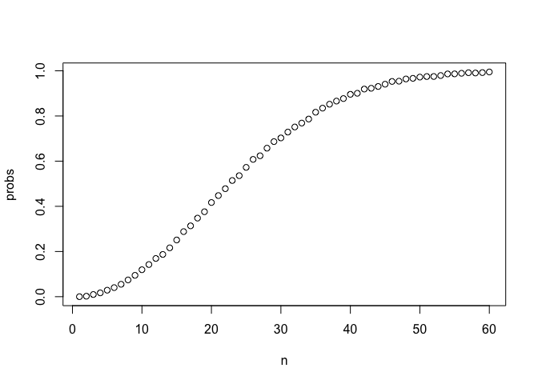
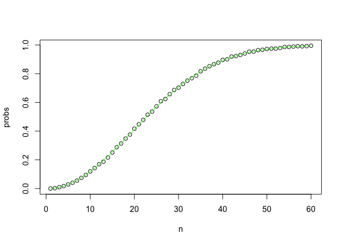
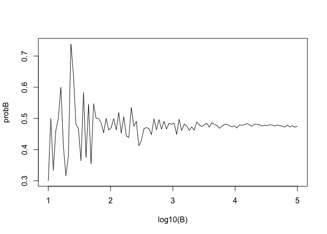

Discrete Probability Reference
================

This is a brief guide to discrete probality in R. It provides background on the statical methods covered, pertinent R functions, and examples of their application. It covers permutations, combinations, and the use of monte carlo simulations to make predictions.

Most examples derive from Harvard Data Science course series on edX (PH125). The examples are to serve as a reference only and examples are either taken directly or adapted from examples in these courses.

Permutations
============

The number of ways r items can be arranged with or without replacement from n items when order matters, v is a vector of items to sample from. If v is not provided the default will be a vector of N integers, 1 - N)

permutations(n=3,r=2,v=x,repeats.allowed= FALSE) in gtools

**Example:** Calculate the number of ways 21 (blackjack) can be made from a deck of cards. Deck is vector of all the different cards in the deck

``` r
library(gtools)
deck <- c('AH', '2H', '3H', '4H', '5H', '6H', '7H', '8H', '9H', '10H', 'JH', 'QH', 'KH','AD', '2D', '3D', '4D', '5D', '6D', '7D', '8D', '9D', '10D', 'JD', 'QD', 'KD','AS', '2S', '3S', '4S', '5S', '6S', '7S', '8S', '9S', '10S', 'JS', 'QS', 'KS','AC', '2C', '3C', '4C', '5C', '6C', '7C', '8C', '9C', '10C', 'JC', 'QC', 'KC')
aces <- c('AH','AD','AS','AC')
tens  <- c('10H','10D','10S','10C','JH','JD','JS','JC','QH','QD','QS','QC','KH','KD','KS','KC')

handsP <- permutations(52, 2, v = deck, repeats.allowed=F)
#handsP is a vector containing all different ways 2 cards can be combined

firstcard <- handsP[,1] #all the first cards
secondcard <- handsP[,2] #all the second cards
```

Number of cases where firsr card is an ace

``` r
sum(firstcard %in% aces)
```

    ## [1] 204

Proportion of cases where first card is an ace

``` r
sum(firstcard %in% aces)/nrow(handsP) 
```

    ## [1] 0.07692308

Gives same portion of cases where first card is an ace

``` r
mean(firstcard %in% aces) 
```

    ## [1] 0.07692308

Proportion of cases where first card is an facecard and second card is an ace

``` r
mean(firstcard %in% tens & secondcard %in% aces)
```

    ## [1] 0.02413273

The probability that the first and second cards will either be a facecard or an ace. ie, all cases of 21.

``` r
blackjackchanceP <- mean(firstcard %in% tens & secondcard %in% aces) + mean(firstcard %in% aces & secondcard %in% tens)
blackjackchanceP
```

    ## [1] 0.04826546

Combinations
============

The number of ways r items can be arranged with or without replacement from n items when order doesn't matter. v is a vector of items to sample from, if v is not provided the default will be a vector of N integers, 1 - N).

combinations(n=3,r=2,v=x,repeats.allowed=F) in gtools

**Example:** Calculate the chance of blackjack

``` r
handsC <- combinations(52,2 ,v = deck, repeats.allowed=F)

blackjackchanceC <- mean(handsC[,1] %in% tens & handsC[,2] %in% aces) + mean(handsC[,1] %in% aces & handsC[,2] %in% tens)
blackjackchanceC
```

    ## [1] 0.04826546

Regardless of approach of using permutations or combinations the same answer of 0.0483 (4.8%) probability. However many more permuations are generated than combinations. Permutation in this case is only necessary for examining such things as what's the probility of pulling an ace as the first card. Comibination loses this detail.

``` r
length(handsP)
```

    ## [1] 5304

``` r
length(handsC)
```

    ## [1] 2652

Monte Carlo for simple prediction
=================================

Monte carlo simulations use random sampling and repetition to allow predictions about the population being sampled.

**Example:** Predict if one or more people in a group of n people share the same birthday assuming any date is as equally likely using a random sampling of 20 individuals. Repeat the simulation 10,000 times.

``` r
B <- 10000 #number of times for monte carlo to sample
n <- 20 #number of people
results <- replicate(B,{ 
  bdays <- sample(1:365, n, replace = TRUE) 
  any(duplicated(bdays))
  })

mean(results)
```

    ## [1] 0.4054

Given a sample of 20 people the probabilty of a duplicated birthday is 40%. If you increase the sample to 200 you have a 100% chance of a duplicated birthday.

**Example:** At how many people is the probability of a duplicated birthday greater than 0.5? Requires examining muliple values of n. Here a sequence of integers from 1 to 60 is used and the generated probabilites for all values of n are plotted.

``` r
prob_calc <- function(n, B=10000) {
  same_bdays <-replicate(B, {
    bdays <- sample(1:365, n, replace = TRUE) 
    any(duplicated(bdays))
  })
  mean(same_bdays)
}

n <- seq(1,60)

probs <- sapply(n, prob_calc)
plot(n, probs)
```

 The plot shows that a value of 22 people results in greater than 50% chance of duplicated birthday.

**Example:** Calculate the exact probability an individual has of a unique bday. Each person added in the group adds a probability: 1 x 364/365 x 363/365…(365-n+1)/365.

``` r
exact_prob <- function(n) {
  unique_prob <- seq(365, 365-n+1)/365
  1-prod(unique_prob)
}
n <- seq(1,60)
plot(n, probs)
uprob <- sapply(n, exact_prob)
lines(n, uprob, col = 'green')  
```



The result is plotted on top of the previous plot and we see agreement with the two methods. Regardless of method at an n between 50 and 60 the chance of two people with a replicated bday is approaching 100%.

Monte carlo simulations only make good predictions if replication (B) is large enough.

The stability of monte carlo simulations can be examine by looking at different values of B.

**Example:** In the duplicated birthdays scenario at what minimum value of B is the simulation reliable?

``` r
prob_calcB <- function(B, n = 22) {
  same_bdays <-replicate(B, {
    bdays <- sample(1:365, n, replace = TRUE) 
    any(duplicated(bdays))
  })
  mean(same_bdays)
}

B <- 10^seq(1,5, len = 100)

probB <- sapply(B, prob_calcB)
plot(log10(B), probB, type = 'l')
```



A B value between 1000 - 10000 (10^3 - 10^4) probability measurement stabalized to 0.5 (the expected value for n=22).
