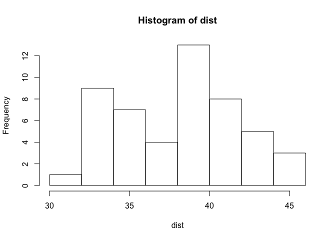
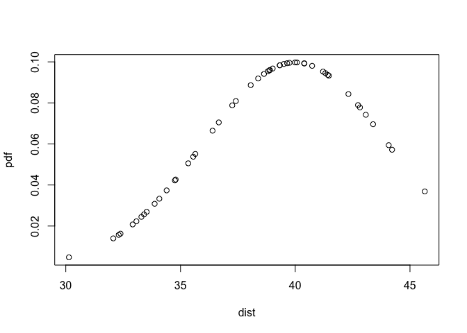
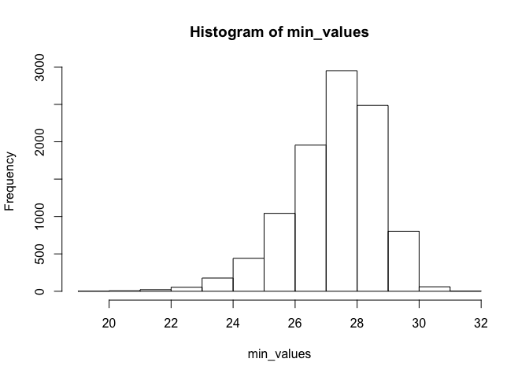
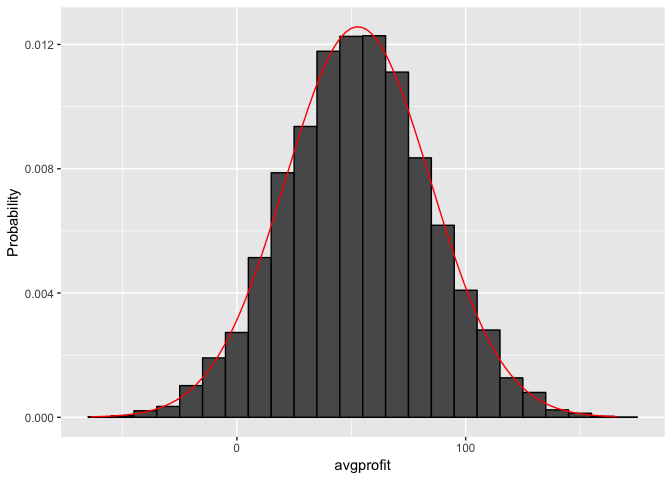

Distribution Functions Reference
================

This is a brief guide to distribution functions and their application to continuous distrubtions in R. It provides background on the statical methods covered, pertinent R functions, and examples of their application. It covers culmative distribution, the central limit theorem, and law of large numbers applied to determing probability of of events and sample modeling. The examples examine primarily leveraging a normal distrubtion even for variables that are not normally distributed and explain the 4 base R functions that are useful for a variety of distributions which are also referenced. The examples include modeling the behavior of a roulette wheel to evaluate potential profit and examining mortage interest and foreclosure rates to increase the probability of profit.

Most examples derive from Harvard Data Science course series on edX (PH125). The examples are to serve as a reference only and examples are either taken directly or adapted from examples in these courses.

Continuous probability
======================

On certain variables or paramters its not useful to assign probability to an individual but to break data into intervals.

**Emprical cumulative distribution function-** The ECDR is the summary of a list of numeric values, it describes the probability the variable takes a value less than or equal to x. F &lt;- function(a) mean(x&lt;=a) F &lt;- function(a) mean(weights &lt;=a)

To get the probabiliy of a cat heavier than 10 lbs from a distribution of cat weights.

Pr = 1-F(10)

To get the probabiliy of a cat between 6 and 9 lbs.

Pr = F(9) - F(6)

The cumulative distribution for the normal distribution can be achieved with pnorm for a distribution (a) with an average (avg), and standard deviation (s).

F(a) = pnorm(q=a, mean=avg, sd=s, lower.tail = T) lower.tail means less than q if true, greater if false

For cat weigh example above, probability to get a cat heavier than 10 pounds, mean of 9.5, sd of 3

pr &lt;- pnorm(10, mean(weights), sd(weights), lower.tail = FALSE) pr &lt;- pnorm(10, 9.5, 3, lower.tail = F)

**Using R functions for the normal distribution**

**rnorm(n, mean = 0, sd = 1) n is number of observations. ** Generates n random numbers following normal distribution given a mean and standard deviation.

``` r
n <- 50
dist <- rnorm(n, mean=40, sd=4)
hist(dist)
```



**dnorm(x, mean = 0, sd = 1, log = FALSE))** x is vector of quantiles Generates Probablity density function or density ()

``` r
pdf <- dnorm(dist, mean=40, sd=4)
plot(dist, pdf)
```



**qnorm(p, mean = 0, sd = 1, lower.tail = TRUE, log.p = FALSE)** p is a vector of probabilities. qnorm calculates quantiles. The first quantile is 0.25. ie, it gives a value that p, proportion or probability, of all the values is less than the computed value.

Calculate 1st quantile

``` r
qnorm(0.25, mean=40, sd=4)
```

    ## [1] 37.30204

25% of the values in this distribution are less than 37.3

**pnorm(q, mean = 0, sd = 1, lower.tail = TRUE, log.p = FALSE)** As stated above gives the cumalitive distribution function or the probility a variable takes a value less than q, the value provided. represents the area under the probability density function in the range less than q. lower.tail = F will give the prob of a value greater than q.

Calculate the chance of a value less than 42

``` r
pnorm(42,mean=40, sd=4)
```

    ## [1] 0.6914625

**Monte carlo simulations** Monte carlo simulations are possible using rnorm to compare to actual data or to perform simulations.

**Example** If 800 values of normally distributed data are choosen at random, what is the distribution of the minimum values?

``` r
B <- 10000
min_values <- replicate(B, {
  simulated_data <- rnorm(800, mean=40, sd=4)
  min(simulated_data)
})
hist(min_values)
```

 What is the chance of minimum less than 28?

``` r
mean(min_values <= 28)
```

    ## [1] 0.6648

Functions for other types of distributions
==========================================

The same suite of functions can be used for other distributions

Beta: pbeta qbeta dbeta rbeta
Binomial: pbinom qbinom dbinom rbinom
Cauchy: pcauchy qcauchy dcauchy rcauchy
Chi-Square: pchisq qchisq dchisq rchisq
Exponential: pexp qexp dexp rexp
F: pf qf df rf
Gamma: pgamma qgamma dgamma rgamma
Geometric: pgeom qgeom dgeom rgeom
Hypergeometric: phyper qhyper dhyper rhyper
Logistic: plogis qlogis dlogis rlogis
Log Normal: plnorm qlnorm dlnorm rlnorm
Negative Binomial: pnbinom qnbinom dnbinom rnbinom
Normal: pnorm qnorm dnorm rnorm
Poisson: ppois qpois dpois rpois
Student: t pt qt dt rt
Studentized Range: ptukey qtukey dtukey rtukey
Uniform: punif qunif dunif runif
Weibull: pweibull qweibull dweibull rweibull
Wilcoxon Rank Sum Statistic: pwilcox qwilcox dwilcox rwilcox
Wilcoxon Signed Rank Statistic: psignrank qsignrank dsignrank rsignrank

Sampling Models
===============

**Model random variables**

**Example:** Model behavior of 1000 spins of a roulette wheel where if the player lands on red the casino loses 1 dollar, else they gain a dollar.

``` r
wheel <- rep(c("Black", "Red", "Green"), c(18, 18, 2))

n <- 1000
draws <- sample(ifelse(wheel=="Red", -1, 1), n, replace = T)
profit <- sum(draws)
profit
```

    ## [1] 42

Based upon proportion of colored spaces and equal chance to land on a space, the draws can be derived more simply. Probability of -1 is eaual to (18+2)/38

``` r
n <- 1000
draws <- sample(c(-1,1), n, replace = T, prob = c(10/19,9/19))
profit <- sum(draws)
profit
```

    ## [1] -70

Simulate 10000 times (monte carlo)

``` r
n <- 1000
B <- 10000
avgprofit <- replicate(B, {
  draws <- sample(c(-1,1), n, replace = T, prob = c(9/19,10/19))
  sum(draws)
})
mean(avgprofit)
```

    ## [1] 52.8812

Compare histogram of avgprofit to density function deriveed from the mean and sd alone. They should show that the simulation matches a normal distribution extremely well.

``` r
library(ggplot2)
library(magrittr)
s <- seq(min(avgprofit), max(avgprofit), length = 100)
normal_density <-data.frame(s = s, f= dnorm(s, mean(avgprofit), sd(avgprofit)))
data.frame(avgprofit = avgprofit) %>% ggplot(aes(avgprofit, ..density..)) +
  geom_histogram(color = "black", binwidth = 10) +
  ylab("Probability") +
  geom_line(data = normal_density, mapping= aes(s,f), color = "red")
```



Central Limit Theorem -
=======================

The CLT describes that for a collection of independant random variables their normalized sum or mean approaches a normal distribution even if the variables are not normally distributed. This allows application of the normal distributions equations and functions through data manipulation.

Given two outcomes a and b, and a probability, p.

mean = ap + b(1-p) (the number of outcomes cancel out)
sd (based upon distribution of whole population which may or may not be available)

The sampling distribution of the mean is the outcome of n draws from the sample repeated several times has
sample mean = ap + b(1-p)
standard error of the sample mean = standard deviation / sqrt(mean)

total expected value = n \* (ap + b(1-p)) total variance = n \* sd^2 total std deviation or standard error of sum = sqrt(n) x sigma = sqrt(n) |b-a| sqrt(p(1-p))) for n= 1, estimated standard error = |b-a| sqrt(p(1-p)))

**Example:** From above roulette example their are two outcomes, a and b.
If a casino wins (+1), black or green, p(a) = 20/38 = 10/19.
If b casino loses(-1), red, p(b) = 18/38 = 1 - p(a) = 9/19.

Expected value of E is
(20 + 18)/38 = $0.05
ap + b(1-p) , n \* (ap + b(1-p)) for n=1

``` r
E <- 1*(10/19)+(-1)*(9/19)
E
```

    ## [1] 0.05263158

Standard error

abs(b-a)sqrt(p(1-p)), abs(b-a)sqrt(np(1-p)) for n=1

``` r
abs(1-(-1))*sqrt(9/19*10/19)
```

    ## [1] 0.998614

The standard error in roulette is close to 1, about the same as the mean.

For 1000 draws, expected value

``` r
sum_draws <-  1000 * (1*(10/19)+(-1)*(9/19))
sum_draws
```

    ## [1] 52.63158

``` r
draw_error = sqrt(1000) * abs(1-(-1))*sqrt(9/19*10/19)
draw_error
```

    ## [1] 31.57895

The expected gain for 1000 games is 52 dollars with an error of 32 dollars.

Chance of losing money, ie getting a value &lt; 0.

``` r
pnorm(0, sum_draws, draw_error)
```

    ## [1] 0.04779035

4.7% chance of losing money.

**Example:** Determine proper interest rates or amount to charge per loan using mortage foreclosure rates.

Predicting potential loss from 1000 loans with a default rate of 2% and a foreclosure loss of 200,000 dollars.

``` r
n <- 1000
l <- -200000 #loss per foreclosure
p <- 0.02
defaults <- sample(c(0,1), n, prob = c(1-p, p), replace = TRUE)
sum(defaults * l)
```

    ## [1] -2800000

Thats a 2-3 million loss.

Adjust amount needed per loan to break even. x is amount that must be added to each loan to offset loss per forecosure, l.
lp + x(1-p) = 0, solve for x

``` r
l <- -200000 #loss per foreclosure
p <- 0.02
x <- l*p/(1-p)
x
```

    ## [1] -4081.633

Want chance of losing money to be 1/100 or 0.01 at calculated value of x. At current value of x. n \*(ap + b(1-p)) for n=1

``` r
l <- -200000 #loss per foreclosure
p <- 0.02
x <- l*p/(1-p)
meanloss <- l*p + x*(1-p)
meanloss
```

    ## [1] -8000

se for n= 1, abs(b-a)sqrt(np(1-p))

``` r
seloss <- abs(x-l)* sqrt(p*(1-p))
seloss
```

    ## [1] 27428.57

Find value of x so that chance of losing money is 0.01.
Z score- Pr(S &lt;0) = 0.01
Through adding and dividing S becomes Z = (S - E(S))/SE\[S\]
Pr((S - E(S))/SE\[S\]) &lt; -E\[S\]/SE\[S\]) = 0.01
Pr(Z &lt; -(n(ap + b(1-p)))/abs(b-a)sqrt(np(1-p)) ) = 0.01
Pr(Z &lt; -(n(lp + x(1-p)))/abs(x-l)sqrt(np(1-p)) ) = 0.01
This makes Z a standard normal variable with expected value = 0 and se = 1

z, the quantile of Z at 0.01 probility is equal to qnorm(0.01) prob(Z) = z

``` r
z <- qnorm(0.01)
z
```

    ## [1] -2.326348

reminder-qnorm(p, mean = 0, sd = 1, lower.tail = TRUE, log.p = FALSE) calculates quantiles, first quantile is 0.25. ie it gives a value that p proportion or probability of all the values is less than the computed value.

Pr(Z &lt; -(n (lp + x(1-p)))/abs(x-l)sqrt(np(1-p)) ) = 0.01 z = -(n (lp + x(1-p)))/abs(x-l)sqrt(np(1-p)), arrange to solve for x

``` r
n <- 1000
l <- -200000 #loss per foreclosure
p <- 0.02
z <- qnorm(0.01)
x <- -l*(n*p - z*sqrt(n*p*(1-p)))/ (n*(1-p) + z*sqrt(n*p*(1-p)))
x
```

    ## [1] 6249.181

``` r
l <- -200000 #loss per foreclosure
p <- 0.02
x <- 6249.181
meanloss <- l*p + x*(1-p)
meanloss #avg profit per loan
```

    ## [1] 2124.197

``` r
l <- -200000 #loss per foreclosure
p <- 0.02
x <- 6249.181
meanloss <- l*p + x*(1-p)
meanloss * 1000
```

    ## [1] 2124197

Indicates a profit of 2.21 million per 1000 loans. Standard error

``` r
l <- -200000 #loss per foreclosure
p <- 0.02
x <- 6249.181
mean <- 2124.197
se <- abs(x-l)* sqrt(p*(1-p))
se
```

    ## [1] 28874.89

Number of loans needed, more below

``` r
z <- qnorm(0.01)
mean <- 2124.197
se <-28874.89
n <- z^2*se^2/mean^2
n
```

    ## [1] 1000.001

Determining the number of loans needed for a profit.
For buffer assume 4% default rate and interest rate, r, at 5%
r &lt;-0.05
x &lt;- r \* 180000
lp + x(1-p)
E\[S\] = n \* mean
SE\[S\] = sqrt(n) \* sd
Pr((S - E(S))/SE\[S\]) &lt; -E\[S\]/SE\[S\]) = 0.01
Pr(Z&lt; -E\[S\]/SE\[S\]) = 0.01
z = -E\[S\]/SE\[S\] = -(n \* mean)/(sqrt(n) \* sd) = -(sqrt(n)\* mean)/sd
low of large numbers, when n is large the avg earning per loan converges to the mean
n &gt;= z^2\*se<sup>2/mean</sup>2

``` r
r <-0.05  
x <- r * 180000 
l <- -200000 
p <- 0.04
n <- ceiling((z^2*(abs(x-l))^2*p*(1-p))/(l * p + x * (1-p))^2)
n
```

    ## [1] 22163

Given an interest rate of %5 and a default rate of 4%, you need 22,163 loans so the risk of losing money is 1%. This means an expected profit of 14 million dollars.

``` r
r <-0.05  
x <- r * 180000 
l <- -200000 
p <- 0.04
n <- 22163
n * (l *p + x * (1-p))
```

    ## [1] 14184320

The estimate of n can be evaluated by performing a monte carlo simulation.

``` r
r <-0.05  
x <- r * 180000 
l <- -200000 
p <- 0.04
n <- 22163
profit <- replicate(B, {
  draws <- sample( c(x, l), n, prob = c(1-p,p), replace= TRUE)
  sum(draws)
})
print(mean(profit))
```

    ## [1] 14137274

``` r
print(mean(profit<0))
```

    ## [1] 0.0114

The profit estimate is about the same and the amount a replicates with a loss is 1%.

An event could suddenly change probability that someone defaults on a loan. You can simulate what would happen at different probabilities.

``` r
r <-0.05  
x <- r * 180000 
l <- -200000 
n <- 22163
profit2 <- replicate(B, {
  new_p <- 0.04 + sample(seq(-0.01,0.01, length= 100), 1)
  draws <- sample( c(x, l), n, prob = c(1-new_p,new_p), replace= TRUE)
  sum(draws)
})
print(mean(profit2))
```

    ## [1] 14255359

``` r
print(mean(profit2<0))
```

    ## [1] 0.3445

``` r
print(mean(profit2 < -10000000))
```

    ## [1] 0.2358

``` r
print(sd(profit2)/sqrt(n))
```

    ## [1] 185421.6

The mean profit is still about 14 million but the probability of a loss raises to about 35%. Also the chance of losing 10 million is about 25%. The standard error itself is 186K and the due to the differing p, the distribution is far from normal.
