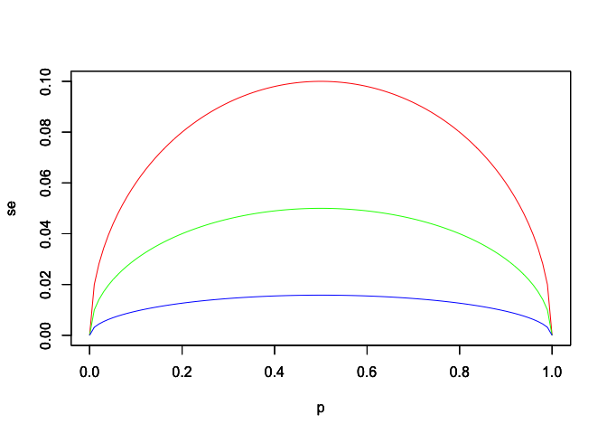
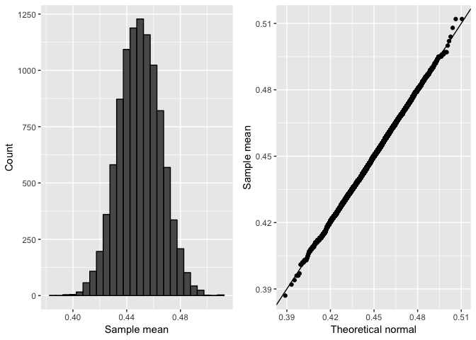

Inference and Modeling Reference
================

This is a brief guide to inference and modeling. It provides background on the statical methods covered, pertinent R functions, and examples of their application. It covers p-value, spread, margin of error, and confidence intervals. These parameters are applied to look at samples to estimate values of the population the derive from and to evaluate the reliability and significance estimates. How to perform monte carlo simulations to make estimates about a population are also examined. The examples included apply these concepts to polling statistics.

Most examples derive from Harvard Data Science course series on edX (PH125). The examples are to serve as a reference only and examples are either taken directly or adapted from examples in these courses.

Mean, standard error, probability, spread, and confidence interval
==================================================================

The expected value of the mean should approximate p E(mean) = p
SE(mean) = sqrt(p(1-p)/n)

Spread: 2p -1
0 means no spread (50-50 chance, p= 0.5). Higher values mean bigger difference in proportions of population.

Confidence interval: mean - 2SE, mean + 2SE, the standard is 95% or 2SE from the mean if it crosses zero you don't have high confidence of choosing correct outcome Pr( mean-2SE &lt;= p &lt;= mean-2SE) Pr( -2 &lt;= (mean - p)/ SE &lt;= 2) Pr( -2 &lt;= Z &lt;= 2)

To get exactly 2 you actual need a slightly larger value than 95%.

``` r
print(qnorm(0.95))
```

    ## [1] 1.644854

``` r
print(qnorm(0.975)) 
```

    ## [1] 1.959964

``` r
print(qnorm(0.97725))
```

    ## [1] 2.000002

p- values
=========

The probability of seeing value Z as large when the null hypothesis is true.
The null hypothesis is when the probability or p = 0.
With large p-values there’s a larger chance that the null hypothesis is true. There is a close connection between p-values and confidence intervals.If a 95% confidence interval of the spread does not include 0, we know that the p-value must be smaller than 0.05.
The p-value is the probability that null hypothesis is true (the result is not signicantly different). A p-value of 3% or 0.03 means that there is only 3% chance that the null hypothesis is true given the set of samples taken.

**Example:** A new program causes a population of children to read faster. A sample 30 children is taken. The previous mean is 20 words per minute and the new mean is 24wpm. Are the results signicant? ie, is the increase real and is this measurement not proabaly if the previous mean is still the true mean. Null hypothesis = 20 wpm Experimental hypothesis &gt; 20 wpm.

The computed p-value is 0.04. This means that these only a 4% chance that the mean of the data is actually 20 or that the null hypothesis is true given the sample. The increase in reading rates is significant.

**p-value** Pr(sqrt(n)abs(mean - 0.5)/sqrt(0.5(1-0.5) &gt; sqrt(n)(0.02)/sqrt(0.5\*(1-0.5))

Spread- 2\*mean -1 half of this is mean - 0.5, p = 0.5 eaual probability Pr(abs(mean- 0.5) &gt; 0.02) \#do some add divide to make normal varible z Pr( abs(mean- 0.5) /SE &gt; 0.02/SE) which is p-value

**Example:** Polling statistics- blue and red beads in an urn. Sampe size is 25, run 4x (gives 4 p = 0.56, 0.6, 0.44, 0.5)

``` r
p_samples <- c(0.56, 0.6, 0.44, 0.5)
n <- 25
p<- mean(p_samples)
print(p)
```

    ## [1] 0.525

``` r
spread <- 2*p-1
print(spread)
```

    ## [1] 0.05

``` r
se <- (1-0)* sqrt(p*(1-p)/n)
print(se)
```

    ## [1] 0.09987492

Sample of 1000, p= 0.51 se would be 0.15 which is a good deal of uncertainty when close to p = 0.5.

**Example:** From a vector of 100 democrats, calculate SE for every value of p.

``` r
p <- seq(0, 1, length = 100)
sample_sizes <- c(25, 100, 1000)
lcol = c("red", "green", "blue")
c <- 1
for(n in sample_sizes){
  se <- sqrt(p*(1-p)/n)
  plot(p,se, ylim = c(0, 0.1), type = "l", col = lcol[c])
  par(new= TRUE)
  c <- c +1
}
```

 The plot demonstrates a lowering of SE increasing sample size.

Estimate difference in proportion of two groups d &lt;- mean - (1-mean) or 2p - 1, the spread

Evaluating strength of estimates
================================

Margin of error - standard error of the spread 2SE\[mean\] = 2sqrt(p(1-p)/n)

**Example:** For a sample of democrats, if p = 0.45, then d = -0.1, losing by large margin (10%). Calculate the error.

``` r
p <- 0.45
n <- 25
spread_error <- 2 * sqrt(p*(1-p)/n) 
spread_error
```

    ## [1] 0.1989975

Evaluating accuracy of measurements

You want to check the validity of the estimate, mean, against the true proportion of the population, p.
What is the probability the difference between p and the mean is 1% or less?
Pr(abs(mean - p) &lt;= 0.01)
Pr(mean &lt;= p + 0.01) - Pr(mean &lt;= p - 0.01)
Subtract the expected value and divide by the std error
Pr((mean - expected(mean)/ SE(mean)) &lt;= ((p + 0.01) - expected(mean))/SE(mean))
- Pr((mean - expected(mean)/ SE(mean)) &lt;= ((p - 0.01) - expected(mean))/SE(mean))
Pr(Z &lt;=((p + 0.01) - expected(mean))/SE(mean)) - Pr(Z &lt;=((p - 0.01) - expected(mean))/SE(mean))
Pr(Z &lt;= 0.01/sqrt(p(1-p)/n)) - Pr(Z &lt;= -0.01/sqrt(p(1-p)/n))
We don't know p, so we make an estimate (^) using the mean, plug-in estimate
SE^ = sqrt(mean\*(1-mean)/n)

``` r
smean <- 0.48
n <- 25
se <- sqrt(smean*(1-smean)/n)
se
```

    ## [1] 0.09991997

Find the probability the difference between the mean and the true value, p, is less than 1%. Pr(abs(mean - p) &lt;= 0.01), Pr(Z &lt;= 0.01/se) - Pr(Z &lt;= -0.01/se)

``` r
pnorm(0.01/se) - pnorm(-0.01/se)
```

    ## [1] 0.07971926

8% chance we are within 1% of the true proportion

**Spread and Margin of Error** 2 std errors from the mean

``` r
smean <- 0.48
n <- 25
se <- sqrt(smean*(1-smean)/n)
spread <- 2*smean -1
print(spread)
```

    ## [1] -0.04

``` r
margin <- 2 * se
print(margin)
```

    ## [1] 0.1998399

The spread is 4 percentage points and the margin is 20%. The margin is much larger than the spread making this a unreliable poll.

**Example:** Determine the probability we are within 2SE from the mean.
Pr(abs(mean- p) &lt;= 2\*se)
Its a probility of a std normal distribution (expected value 0 , se 1).

``` r
pnorm(2)-pnorm(-2)
```

    ## [1] 0.9544997

Monte Carlo for CLT
===================

A true simulation can't be run really as is because we don't know p, but we can choose p value of p.

``` r
p <- 0.45
B <- 10000
n <- 1000
smean <- replicate(B, {
  sam <- sample(c(0,1), size = n, replace = TRUE, prob= c(1-p,p))
  mean(sam)
})

mm <- mean(smean)
print(mm)
```

    ## [1] 0.4497121

``` r
print(sd(smean))
```

    ## [1] 0.01562934

``` r
se <- sqrt(smean*(1-smean)/n)
mse <- mean(se)
print(mse)
```

    ## [1] 0.01572337

``` r
print(pnorm(0.01/mse) - pnorm(-0.01/mse))
```

    ## [1] 0.475221

``` r
#There is about a 48% chance the difference between mean derived from the monte carlo simulation and the true mean is less #than 1%.  We can see that the simuated mean is very, very close to the provided p.  

#Plot histogram and qqplot to show its approximation of a normal distribution. 
library(gridExtra)
library(ggplot2)
library(magrittr)
p1 <- data.frame(smean= smean) %>% ggplot(aes(smean)) +
  geom_histogram(binwidth = 0.005, col = "black") +
  xlab("Sample mean") +
  ylab("Count")
p2 <- data.frame(smean = smean) %>% ggplot(aes(sample = smean)) +
  stat_qq(dparams = list(mean = mean(smean), sd=sd(smean))) +
  geom_abline() +
  ylab("Sample mean") +
  xlab("Theoretical normal") 
grid.arrange(p1,p2, nrow = 1)
```



The distrubtion shows a very close match to a normal distribution.
